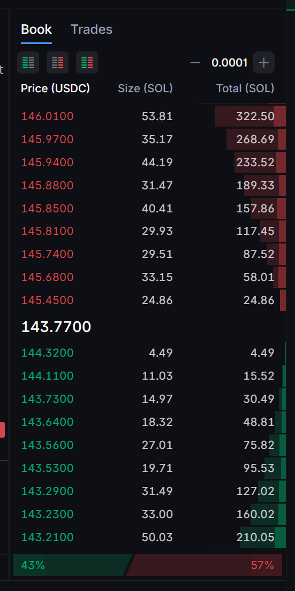

# Backpack Exchange API


Access the official API documentation here: [https://docs.backpack.exchange/](https://docs.backpack.exchange/).

This repository contains API clients for Backpack Exchange. Currently, only a `Rust` client is available. For more details, see the [Rust Client README](./rust/client/README.md).



*Example of an Order Book*

## Setup Instructions

Assuming Rust and Cargo are installed via rustup:

1. **Navigate to the Rust Folder**:
   ```bash
   cd rust

2. **Install just**:
   ```bash
   cargo install just

3. **Build All Packages**:
   ```bash
   just build

4. **Move to the Examples Directory**:
   ```bash
   cd examples

For detailed instructions on running the examples, including configuring environment variables, see the [Examples README](./rust/examples/README.md).


## Contributing

We welcome contributions from the community!  
Feel free to open bug reports, suggest new features, or submit pull requests to improve the client and related components.

## License

This project is licensed under the [Apache 2.0 License](LICENSE).