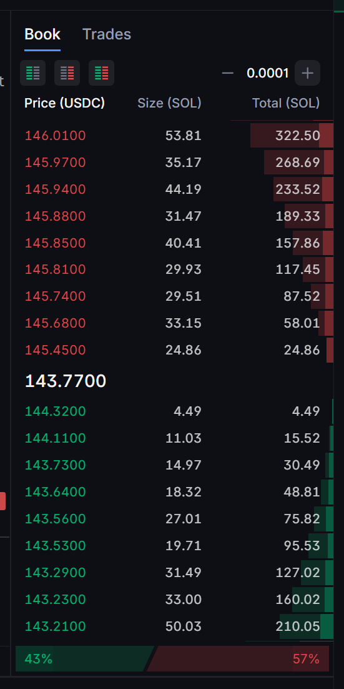

# Backpack Exchange API


Access the official API documentation here: [https://docs.backpack.exchange/](https://docs.backpack.exchange/).

This repository contains API clients for Backpack Exchange. Currently, only a `Rust` client is available. For more details, see the [Rust Client README](./rust/client/README.md).



*Example of an Order Book*

## Setup Instructions

Assuming Rust and Cargo are installed via rustup:

1. **Navigate to the Rust Folder**:
   ```bash
   cd rust

2. **Install just**:
   ```bash
   cargo install just

3. **Build All Packages**:
   ```bash
   just build

4. **Move to the Examples Directory**:
   ```bash
   cd examples

For detailed instructions on running the examples, including configuring environment variables, see the [Examples README](./rust/examples/README.md).


## Contributing

We welcome contributions from the community!  
Feel free to open bug reports, suggest new features, or submit pull requests to improve the client and related components.

## License

This project is licensed under the [Apache 2.0 License](LICENSE).
## WebSocket compression (`permessage-deflate`)

The exchange WebSocket API negotiates [RFC 7692] `permessage-deflate`. On
market-data streams it reduces wire traffic 5-7x. Upstream `tungstenite`
has no deflate support yet, so this feature compiles only against the same
forks the exchange server uses. To enable it:

1. Add both patches to the **workspace root** `Cargo.toml` of your
   application (patch sections apply only from the final workspace):

   ```toml
   [patch.crates-io]
   tungstenite = { git = "https://github.com/openai-oss-forks/tungstenite-rs", rev = "4fffad30fe373adbdcffab9545e9e9bf4f2fc19f" }
   tokio-tungstenite = { git = "https://github.com/openai-oss-forks/tokio-tungstenite", rev = "0e5b2d73aa18dd9f0a50ee9ff199d5aef7594186" }
   ```

2. Turn on the `deflate` feature of the patched crate with a direct
   dependency, and enable this crate's feature:

   ```toml
   [dependencies]
   bpx-api-client = { version = "*", features = ["permessage-deflate"] }
   tungstenite = { version = "0.27", default-features = false, features = ["deflate"] }
   ```

3. Nothing else changes: `subscribe` offers compression on the handshake,
   the server selects it, and frames decompress transparently. Servers
   without the extension fall back to uncompressed connections.

If the build fails with `unresolved import ... extensions::compression`
or an unknown `deflate` feature, the patch section is missing or not at
the workspace root.

[RFC 7692]: https://datatracker.ietf.org/doc/html/rfc7692
